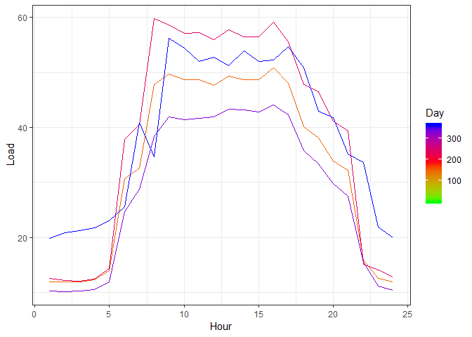

# Solar Plus Storage Simulation Model for Net Billing
Jin An, Yi

## 1. Introduction
In the U.S., for a non-utility scale solar+storage project, its main economic incentive comes from its rate structure at retail electricity market. This will not change too much before FERC Order 841 being implemented, which [requires a minimum size for participation in RTO/ISO wholesale markets not to exceed 100 kW](https://www.utilitydive.com/news/ferc-order-opens-floodgates-for-energy-storage-in-wholesale-markets/517326/), making smaller scale storage able to join the wholesale market.   

At retail level, there are multiple ways to create incentive for a solar+storage project, such as time-of-use (ToU), demend charge and net billing. And for this model, I will focus on net billing.  

Net billing creates economic incentive for solar+storage [by purchasing excess solar electricity production fed to the grid from the project owner](https://cleanenergysolutions.org/instruments/net-metering-net-billing), and the purchase price (usually at wholesale price or "avoided cost") will be lower than the retail price. This creates a price gap between self-consumption and exporting electricity, allowing storage system to storage excess production for later use, and maximize self-consumption rate and energy saving.  

Given that, in order to estimate the economic value of a solar+storage project, a simulation model must compare solar production profile and load profile, and see how much a particular storage application (almost always going to be a battery) can increase the self-consumption rate (SCR, defined as solar energy self-comsumed divided by total solar production), and increase energy saving.  

## 2. Source of the Model
The simulation model's basic structure (the `battery_simulation` function) comes from [Quantifying self-consumption linked to solar home battery systems: Statistical analysis and economic assessment](https://doi.org/10.1016/j.apenergy.2016.08.077), by Sylvain Quoilin, Konstantinos Kavvadias, Arnaud Mercier, Irene Pappone, and Andrea Zucker. In its [electronic annexes](https://github.com/squoilin/Self-Consumption/releases/tag/v1.0), the `battery_simulation` functoin in `SC_function.py` is the main source of reference. However, the model is translated into R (the language that I am more used to), and incorporates more factors such as project lifetime and battery degradation. 


## 3. Simulation Model Design
### 3-1. Battery Dispatch Algorithm  
  
>"The dispatch of the storage capacity is performed in such a way to maximize self-consumption: the battery is charged when the PV power is higher than the load and as long as it is not fully charged. It is discharged as soon as the PV power is lower than the load and as long as it is not fully discharged."  (Quoilin, Kavvadias, Mercier, Pappone & Zucker, 2016)  

Granted, the dispatch algorithm of this model might not be the most economic. Because extensive uasage might greatly reduce the battery lifetime, thus decrease project monetary return. Also, this algorithm treats PV production as given, it does not consider resizing the PV system to be even more optimized.  

### 3-2. Assumptions  
1. Degradation is based on battery generation (throughput) solely at a fixed rate, which could potentially underestimate degradation (there are still other factors such as time, temperature and physical stress), thus overestimate self-consumption rate.   
2. Smooth curves for both production and load, which overestimates self-consumption rate since more fluctuation in production and load profiles might overwhelm battery maximum power. This is especially true with coarse granularity data.  
3. One year of data (365 days, 8760 hours) is used.  
4. Maximum power of the battery is the same for both charge and discharge, and it is a constant (no degradaiton over time).  
5. The battery does not take energy from the grid  
6. The battery does not self-discharge.  
7. The battery's level of charge is 50% at time zero. 
8. Load profile does not change over the years.  
9. No backup mode usage.  
10. It is a DC-coupled system

*For consistency, in this model, all input parameters with proportion are all unitless (not in %). But when it comes to output, % is used. In addition, all "degradation rate" is perceived as rate of decrease here, so it should be a number close to zero when time interval is small.  

These packages are needed.  

```r
library(dplyr)
library(tidyr)
library(ggplot2)
```
  
### 3-3. The Dispatch Simulation Model

### 3-3-1. Parameters of the Model
`PV`: Vector of a year of PV generation, in kW DC (i.e. before the inverter, not kwh).  

`load`: Vector of a year of electricity consumption, in kW (not kwh).  

`timestep`: Simulation time step (in hours). If it is 15-minute interval data, it should be 0.25.  

`BatteryCapacity`: Available battery capacity (i.e. only the the available energy), in kWh.

`BatteryEfficiency`: Battery round-trip efficiency. Default is 1.  

`InverterEfficiency`: Inverter efficiency, default is 1.  

`MaxPower`: Maximum battery charging or discharging powers (assumed to be equal), kW. Default is assumed to be 10^15.  

`DegradationPerkWh`: Rate of degradation per kWh on its capacity (should be a small number close to zero, as accurate as possible, not in %). Default is 0.  

`PVAnnualDegradation`: Rate of degradation per year on PV production (should be a small number close to zero).  Default is 0.  

`print_analysis`: If it prints out a list of results on system performance. By default, it is TRUE.  

`output_timeseries`: If it returns the time series data used for simulation. By default it is FALSE, meaning it will just return the self-consumption rate (in %).  

`round_digit`: Round to which digit (not including residue)? Default is 2.    

### 3-3-2. Outputs
Printed results: When print_analysis = TRUE, a list of results is printed (see the output of example 1 for mroe details on what are the results). All results annualized.  

Self-Consumption Rate (SCR, in %): It is returned and printed when output_timeseries = TRUE. 

Time series data: A dataframe is printed and returned when output_timeseries = FALSE. There are four columns: BatteryGeneration (kW), BatteryConsumption (kW), LevelOfCharge (kWh, how much energy is in the battery), PowerWithGrid (kW, power flow with the grid, being positive means taking energy from the grid).

### 3-3-3. The battery_simulation function

```r
battery_simulation <- function(PV,load, timestep = 1, BatteryCapacity, BatteryEfficiency = 1, InverterEfficiency = 1, MaxPower = 1E15, DegradationPerkWh = 0, PVAnnualDegradation = 0, n_year = 1, print_analysis = TRUE, output_timeseries = FALSE, round_digit = 2) {

    #Initialize variables:
    PV <- unlist(lapply(1:n_year, function(n){
        PV * (1 - PVAnnualDegradation)^(n - 1)
    }))
    load <- rep(load, times = n_year)
    
    Nsteps <- length(PV)
    LevelOfCharge <- numeric(length = Nsteps + 1)    # kWh
    PowerWithGrid <- numeric(length = Nsteps)       # kWh, selfish convention (> 0 if buying from grid)
    BatteryGeneration <- numeric(length = Nsteps)    # kW 
    BatteryConsumption <- numeric(length = Nsteps)   # kW
    retain_rate <- 1 - DegradationPerkWh
    left <- 1  #overall proportion of useful capacity due to degradation
    
    if(BatteryCapacity > 0) {
        LevelOfCharge[1] <- BatteryCapacity/2 #initial level of charge at time zero
    
        NetDemandDC <- load/InverterEfficiency - PV
        BatteryGeneration_accumulation <- 0
    
        for(i in 1:Nsteps) {
            MaxDischarge <- min(MaxPower,LevelOfCharge[i]*BatteryEfficiency/timestep)
            MaxCharge <- min(MaxPower,(BatteryCapacity * left - LevelOfCharge[i])/ timestep)
            BatteryGeneration[i] <- min(MaxDischarge,max(0,NetDemandDC[i])) #kw, not kwh
            BatteryConsumption[i] <- min(MaxCharge,max(0,-NetDemandDC[i]))  #kw, not kwh
            LevelOfCharge[i+1] <- LevelOfCharge[i] + BatteryConsumption[i] * timestep - BatteryGeneration[i] / BatteryEfficiency * timestep  #LevelOfCharge has Nsteps + 1
            
            BatteryGeneration_accumulation <- BatteryGeneration_accumulation + BatteryGeneration[i]
            
            left <- retain_rate ^ (BatteryGeneration_accumulation * timestep)
            
            PowerWithGrid[i] <- (load[i] - (PV[i] + BatteryGeneration[i] - BatteryConsumption[i])*InverterEfficiency)*timestep    #positive means taking energy from the grid, in AC
        }
    } else {
        PowerWithGrid <- (load - PV*InverterEfficiency)*timestep
    }
        
    EnergyFromGrid <- pmax(0,PowerWithGrid)
    TotalLoad <- sum(load)*timestep    
    TotalFromGrid <- sum(EnergyFromGrid)
    SelfConsumption <- TotalLoad - TotalFromGrid   
    SelfSufficiencyRate <- (SelfConsumption/TotalLoad) * 100 #in %
    
    TotalPV <- sum(PV)*timestep
    SelfConsumptionRate <- (SelfConsumption/TotalPV)*100  #in %
    
    if(print_analysis){
        EnergyToGrid <- pmax(0,-PowerWithGrid)
        TotalToGrid <- sum(EnergyToGrid)
        TotalBatteryGeneration = sum(BatteryGeneration)*timestep
        TotalBatteryConsumption = sum(BatteryConsumption)*timestep
        BatteryLosses <- TotalBatteryConsumption - TotalBatteryGeneration
        InverterLosses <- (TotalPV - BatteryLosses)*(1-InverterEfficiency)
        AverageDepth <- sum(BatteryGeneration*timestep)/(365.25 * n_year * BatteryCapacity)
        Nfullcycles <- 365.25*AverageDepth 
        residue <- TotalPV + TotalFromGrid - TotalToGrid - BatteryLosses - InverterLosses - TotalLoad   #should be a zero
    
        print(paste0("Annual consumption: ",  round(TotalLoad/ n_year, round_digit), " kWh"))
        print(paste0("Annual PV production: ", round(TotalPV/ n_year, round_digit), " kWh"))
        print(paste0("Annual self consumption: ", round(SelfConsumption/ n_year, round_digit), " kWh"))
        print(paste0("Annual fed to the grid: ", round(TotalToGrid/ n_year, round_digit), " kWh"))
        print(paste0("Annual bought from the grid: ", round(TotalFromGrid/ n_year, round_digit), " kWh"))
        print(paste0("Self consumption rate (SCR): ", round(SelfConsumptionRate, round_digit), "%"))
        print(paste0("Self sufficiency rate (SSR): ", round(SelfSufficiencyRate, round_digit), "%"))
        print(paste0("Annual amount of energy provided by the battery: ", round(TotalBatteryGeneration/ n_year, round_digit), " kWh"))
        print(paste0("Average Charging/Discharging depth: ", round(AverageDepth * 100, round_digit), "%"))
        print(paste0("Number of equivalent full cycles per year: ", round(Nfullcycles, round_digit)))
        print(paste0("Annual battery losses: ", round(BatteryLosses/ n_year, round_digit), " kWh"))
        print(paste0("Annual inverter losses: ", round(InverterLosses/ n_year, round_digit), " kWh"))
        print(paste0("Residue (check): ", residue, " kWh (should be zero)"))
    }
    
    if(output_timeseries) {
        return(data.frame(BatteryGeneration = BatteryGeneration,
                          BatteryConsumption = BatteryConsumption,
                          LevelOfCharge = LevelOfCharge[-1],
                          PowerWithGrid = PowerWithGrid))
    } else {return(round(SelfConsumptionRate, round_digit))}
}
```


### 3-6. Battery Degradation Rate Function
These functions accept `left_proportion` (proportion of capacity left after the throguhtput, not in %) and `throughput` (in MWh), and gives you degradation rate per kWh of discharge (or MWh, for `degradation_rate_MWh`). This can be used in the `DegradationPerkWh` parameter in the `battery_simulation` function. Users can usually use the specification on the warranty as an estimate of battery degradation rate.  


```r
#degradation rate per kWh of discharge
degradation_rate_kWh <- function(left_proportion, throughput_MWh){
    return(
        1 - left_proportion^(1/ (throughput_MWh * 1000))
    )
}
#degradation rate per MWh of discharge
degradation_rate_MWh <- function(left_proportion, throughput_MWh){
    return(
        1 - left_proportion^(1/ (throughput_MWh))
    )
}

#22.4MWh, 60%. The two should be the same number since it's just unit conversion.
1 - (1 - degradation_rate_kWh(0.6, 22.4))^1000
```

```
## [1] 0.02254665
```

```r
degradation_rate_MWh(0.6, 22.4)
```

```
## [1] 0.02254665
```
  
  
### 3-7. Comparing Difference with Changing Battery Capacity

This function, `battery_simulation_compare`, is built on `battery_simulation` and produces multiple self-consumption rates to compare. Instead of having just one set of parameters, the user can input any number of parameter sets (except for `PV` and `load`).  

Using `mapply()`, it gives users flexibility to add multiple `BatteryCapacity`, `BatteryCapacity`, `BatteryEfficiency`, `InverterEfficiency`, `MaxPower`, `DegradationPerkWh`, `PVAnnualDegradation`, `n_year` and `round_digit` arguments, all as a numeric vector. Those arguments which are shorter than the longest one will be recycled/ reused until they are all the same length (see example 3 for more details). `timestep` is the exception: it should have only one value because the function only takes one set of load and production profile.  

It is not recommended to change too many variables at the same time for comparison since it is methodologically inappropriate.  

In addition, this function does not print the analysis results as in `battery_simulation`. If output_timeseries = FALSE (as default), it returns the self-consumption rate (in %) and other parameter settings as a dataframe. If output_timeseries = TRUE, it returns a list of time series data for each parameter set, and includes a `parameters` dataframe recording the arguments.  


```r
#The battery_simulation_compare function
battery_simulation_compare <- function(PV,load, timestep = 1, BatteryCapacity, BatteryEfficiency = 1, InverterEfficiency = 1, MaxPower = 1E15, DegradationPerkWh = 0, PVAnnualDegradation = 0, n_year = 1, output_timeseries = F, round_digit = 2){
    if(length(timestep) != 1) {stop("'timestep' should have only one value because the function only takes one set of load and production profile")}
    
    if(!output_timeseries) {
        result <- data.frame(
            SelfConsumptionRate = NA,
            timestep = timestep,
            BatteryCapacity = BatteryCapacity,
            BatteryEfficiency = BatteryEfficiency,
            InverterEfficiency = InverterEfficiency,
            MaxPower = MaxPower,
            DegradationPerkWh = DegradationPerkWh,
            PVAnnualDegradation = PVAnnualDegradation,
            n_year = n_year
        )    

        result$SelfConsumptionRate <- mapply(battery_simulation, 
               replicate(n = length(BatteryCapacity), list(PV)), 
               replicate(n = length(BatteryCapacity), list(load)), 
               timestep, BatteryCapacity, BatteryEfficiency, InverterEfficiency, MaxPower, DegradationPerkWh, PVAnnualDegradation, n_year, F, F, round_digit,
               USE.NAMES = F)
    } else {
        parameters <- data.frame(
            timestep = timestep,
            BatteryCapacity = BatteryCapacity,
            BatteryEfficiency = BatteryEfficiency,
            InverterEfficiency = InverterEfficiency,
            MaxPower = MaxPower,
            DegradationPerkWh = DegradationPerkWh,
            PVAnnualDegradation = PVAnnualDegradation,
            n_year = n_year
        )   
        
        result <- mapply(battery_simulation, 
               replicate(n = length(BatteryCapacity), list(PV)), 
               replicate(n = length(BatteryCapacity), list(load)), 
               timestep, BatteryCapacity, BatteryEfficiency, InverterEfficiency, MaxPower, DegradationPerkWh, PVAnnualDegradation, n_year, F, T, round_digit,
               SIMPLIFY = F,
               USE.NAMES = F)
        
        result[["parameters"]] <- parameters
    }
    
    return(result)
}
```

### 3-8. Present Cost Comparison

This funcition, `PC_bill`, calculates the present cost of utility bill given a set of solar+storage systems under net billing, using time series data coming from `battery_simulation_compare` and the load profile.  

Other inputs include discount rate, retail price of electricity (dollar per kWh), price sold to the grid (dollar per kWh) and annual escalation rate of both prices (assuming the same). The user can use `plan_zero_n_year` to input a numeric vector, and compute a set of present cost of utility bill for no PV or storage at all, given the number of years the user input.  

The output is a dataframe which consists of all relevant parameter and present cost results. If `plan_zero_n_year` is used, extra rows will be included (see example 4 for more details). This function also assumes all payments are made at the end of the year.  


```r
#PC stands for present cost
PC_bill <- function(data, discount, retail_p, sell_p, escalate, load, plan_zero_n_year = NULL) {
    #PowerWithGrid variable tells us how much we import from (positive)/ export to (negative) the grid
    import_export <- lapply(1:(length(data)-1), function(i) {
        arguments <- data[["parameters"]][i, ]        
        table <- data[[i]]["PowerWithGrid"]
        table$year <- rep(1:arguments[["n_year"]], each = 365*24/arguments[["timestep"]])
        return(table)
    })
    
    #This is the present cost of the utility bill in each model scenario
    PC_bill <- sapply(1:length(import_export), function(i) {
        arguments <- data[["parameters"]][i, ]
        table <- mutate(import_export[[i]], export = pmin(PowerWithGrid, 0), import = pmax(PowerWithGrid, 0)) #import is positive, export is negative
        table <- group_by(table, year) %>%
            summarise(annual_export = sum(export) * arguments[["timestep"]], annual_import = sum(import) * arguments[["timestep"]])
        #discounting
        table$year <- 1:arguments[["n_year"]]
        table <- transmute(table, PC_export = annual_export * (sell_p*(escalate+1)^year)/(discount+1)^year, PC_import = annual_import * (retail_p*(escalate+1)^year)/(discount+1)^year)
        
        return(sum(table$PC_import) + sum(table$PC_export))
        }, USE.NAMES = F)
    
    result <- data[["parameters"]]
    result$PC_bill <- PC_bill
    
    #If there is no PV and battery at all, the present cost of utility bill
    if(!is.null(plan_zero_n_year)) {
        r <- 1 - (1+escalate)*(1+discount)
        plan_zero <- sapply(plan_zero_n_year, function(n) {
            sum(load) * data[["parameters"]][1, "timestep"] * sell_p * ((r + 1)^n-1)/ (r * (r + 1)^n)
        })
        #put the data into the result
        result_row <- nrow(result)
        result[(result_row+1):(result_row+length(plan_zero_n_year)), "n_year"] <- plan_zero_n_year
        result[(result_row+1):(result_row+length(plan_zero_n_year)), "PC_bill"] <- plan_zero
    }
    
    return(result)
}
```

## 4. Examples
Example data: A fictional commercial project (an office), both load profile and production profile data are from [Aurora Solar](https://www.aurorasolar.com/). Within each season, load profile is the same everyday. As you can imagine, the data is not realistic.  


```r
options(stringsAsFactors = F)
#load them
ex_PV <- read.csv("DATA/ex_PV.csv")
ex_load <- read.csv("DATA/ex_load.csv")

#the input should be a numeric vector, not a dataframe
ex_PV <- unlist(ex_PV, use.names = F)
ex_load <- unlist(ex_load, use.names = F)
```
  
Visualization of solar production:  

```r
ggplot(data.frame(Hour = rep(1:24, times = 365), Day = rep(1:365, each = 24), Production = ex_PV)) +
    geom_line(aes(x = Hour, y = Production, color = Day, group = Day), alpha = 0.5) +
    scale_colour_gradientn(colours = terrain.colors(4)) +
    theme_bw()
```


  
Visualization of load profile (daily profiles are the same for each reason):  

```r
ggplot(data.frame(Hour = rep(1:24, times = 365), Day = rep(1:365, each = 24), Load = ex_load)) +
    geom_line(aes(x = Hour, y = Load, color = Day, group = Day)) +
    scale_colour_gradientn(colours = c("green", "red", "blue")) +
    theme_bw()
```


  
Notice that the shape of the two are close, and load is larger than production for most of the time, meaning there is not a lot of gap between load and PV production, and limited room for a storage system to do load shifting.  

### 4-1. Example 1: Too Much PV Production, Too Little Load

Battery degradation is assumed to be 60% capacity left after 22.4MWh throughput. Project lifetime is 10 years.  


```r
battery_simulation(
    PV = ex_PV/ 0.99,  #it should be before inverter production 
    load = ex_load, 
    BatteryCapacity = 8.6, 
    BatteryEfficiency = 0.965, 
    InverterEfficiency = 0.99, 
    MaxPower = 4.2, 
    DegradationPerkWh = degradation_rate_kWh(left_proportion = 0.6, throughput_MWh = 22.4), 
    PVAnnualDegradation = 0.01, 
    n_year = 10)
```

```
## [1] "Annual consumption: 306234.88 kWh"
## [1] "Annual PV production: 56033.86 kWh"
## [1] "Annual self consumption: 55473.93 kWh"
## [1] "Annual fed to the grid: 0 kWh"
## [1] "Annual bought from the grid: 250760.95 kWh"
## [1] "Self consumption rate (SCR): 99%"
## [1] "Self sufficiency rate (SSR): 18.11%"
## [1] "Annual amount of energy provided by the battery: 0.41 kWh"
## [1] "Average Charging/Discharging depth: 0.01%"
## [1] "Number of equivalent full cycles per year: 0.05"
## [1] "Annual battery losses: -0.41 kWh"
## [1] "Annual inverter losses: 560.34 kWh"
## [1] "Residue (check): -4.65661287307739e-10 kWh (should be zero)"
```

```
## [1] 99
```

```r
#same setting but without battery (only BatteryCapacity = 0 needs to be specificied, other battery-related parameters can be ignored)
battery_simulation(
    PV =  ex_PV/ 0.99,  #it should be before inverter production 
    load = ex_load, 
    BatteryCapacity = 0, 
    InverterEfficiency = 0.99, 
    PVAnnualDegradation = 0.01, 
    n_year = 10)
```

```
## [1] "Annual consumption: 306234.88 kWh"
## [1] "Annual PV production: 56033.86 kWh"
## [1] "Annual self consumption: 55473.52 kWh"
## [1] "Annual fed to the grid: 0 kWh"
## [1] "Annual bought from the grid: 250761.36 kWh"
## [1] "Self consumption rate (SCR): 99%"
## [1] "Self sufficiency rate (SSR): 18.11%"
## [1] "Annual amount of energy provided by the battery: 0 kWh"
## [1] "Average Charging/Discharging depth: NaN%"
## [1] "Number of equivalent full cycles per year: NaN"
## [1] "Annual battery losses: 0 kWh"
## [1] "Annual inverter losses: 560.34 kWh"
## [1] "Residue (check): 0 kWh (should be zero)"
```

```
## [1] 99
```

From the super high self-consumption rate, we know that the PV production is too small compare to the load, so the battery is barely used (thus the negative annual battery losses from initial level of charge), and the SCR does not increase due to the battery system.  
  
### 4-2. Example 2: PV Production = Load
What if there is a lot less load in the same setting? (total load = total PV production in the first year)

```r
battery_simulation(
    PV =  ex_PV/ 0.99,  #it should be before inverter production 
    load = ex_load * sum(ex_PV)/ sum(ex_load), #scale down the load so that total load = total PV production
    BatteryCapacity = 8.6, 
    BatteryEfficiency = 0.965, 
    InverterEfficiency = 0.99, 
    MaxPower = 4.2, 
    DegradationPerkWh = degradation_rate_kWh(left_proportion = 0.6, throughput_MWh = 22.4), 
    PVAnnualDegradation = 0.01, 
    n_year = 10)
```

```
## [1] "Annual consumption: 58015.82 kWh"
## [1] "Annual PV production: 56033.86 kWh"
## [1] "Annual self consumption: 30383.75 kWh"
## [1] "Annual fed to the grid: 25020.21 kWh"
## [1] "Annual bought from the grid: 27632.06 kWh"
## [1] "Self consumption rate (SCR): 54.22%"
## [1] "Self sufficiency rate (SSR): 52.37%"
## [1] "Annual amount of energy provided by the battery: 1948.93 kWh"
## [1] "Average Charging/Discharging depth: 62.05%"
## [1] "Number of equivalent full cycles per year: 226.62"
## [1] "Annual battery losses: 70.26 kWh"
## [1] "Annual inverter losses: 559.64 kWh"
## [1] "Residue (check): -1.16415321826935e-10 kWh (should be zero)"
```

```
## [1] 54.22
```

```r
#same setting but no battery
battery_simulation(
    PV =  ex_PV/ 0.99,  #it should be before inverter production 
    load = ex_load * sum(ex_PV)/ sum(ex_load), 
    BatteryCapacity = 0, 
    InverterEfficiency = 0.99, 
    PVAnnualDegradation = 0.01, 
    n_year = 10)
```

```
## [1] "Annual consumption: 58015.82 kWh"
## [1] "Annual PV production: 56033.86 kWh"
## [1] "Annual self consumption: 28454.31 kWh"
## [1] "Annual fed to the grid: 27019.21 kWh"
## [1] "Annual bought from the grid: 29561.51 kWh"
## [1] "Self consumption rate (SCR): 50.78%"
## [1] "Self sufficiency rate (SSR): 49.05%"
## [1] "Annual amount of energy provided by the battery: 0 kWh"
## [1] "Average Charging/Discharging depth: NaN%"
## [1] "Number of equivalent full cycles per year: NaN"
## [1] "Annual battery losses: 0 kWh"
## [1] "Annual inverter losses: 560.34 kWh"
## [1] "Residue (check): 0 kWh (should be zero)"
```

```
## [1] 50.78
```

Overall, there is minimal difference in SCR. This might because it is office load profile with very little night time load. In addition, the weekend profile is the same as weekday profile from Aurora solar, which is unrealistic.  

Let's see the visualization of the first 7 days of dispatch pattern (remember, without considering energy loss, load + battery consumption = PV production + battery generation + energy with grid):  


```r
#get time series data
data_ex2 <- battery_simulation(
    PV =  ex_PV/ 0.99,  #it should be before inverter production 
    load = ex_load * sum(ex_PV)/ sum(ex_load),
    BatteryCapacity = 8.6, 
    BatteryEfficiency = 0.965, 
    InverterEfficiency = 0.99, 
    MaxPower = 4.2, 
    DegradationPerkWh = degradation_rate_kWh(left_proportion = 0.6, throughput_MWh = 22.4), 
    PVAnnualDegradation = 0.01, 
    n_year = 10, 
    print_analysis = F,
    output_timeseries = T)

#let's extract only the 7 days
dispatch_data <- data_ex2[1:(24*7), c(1, 2, 4)]
dispatch_data$PV <- ex_PV[1:(24*7)]/ 0.99
dispatch_data$Load <- ex_load[1:(24*7)] * (sum(ex_PV)/ sum(ex_load))
dispatch_data$Hour <- 1:(24*7)

#check power balance on the AC side (should be zero)
transmute(dispatch_data, residue = Load  + (BatteryConsumption - PV - BatteryGeneration)*0.99 - PowerWithGrid)
```

```
##           residue
## 1   -4.440892e-16
## 2    0.000000e+00
## 3   -8.881784e-16
## 4    0.000000e+00
## 5   -8.881784e-16
## 6   -8.881784e-16
## 7    0.000000e+00
## 8    0.000000e+00
## 9   -1.776357e-15
## 10   0.000000e+00
## 11  -1.776357e-15
## 12   0.000000e+00
## 13  -1.776357e-15
## 14  -1.776357e-15
## 15   0.000000e+00
## 16  -1.776357e-15
## 17   0.000000e+00
## 18   0.000000e+00
## 19   0.000000e+00
## 20  -8.881784e-16
## 21   0.000000e+00
## 22  -8.881784e-16
## 23  -8.881784e-16
## 24  -4.440892e-16
## 25  -4.440892e-16
## 26   0.000000e+00
## 27  -8.881784e-16
## 28   0.000000e+00
## 29  -8.881784e-16
## 30  -8.881784e-16
## 31   0.000000e+00
## 32   0.000000e+00
## 33  -1.776357e-15
## 34   0.000000e+00
## 35  -1.776357e-15
## 36   0.000000e+00
## 37  -1.776357e-15
## 38  -1.776357e-15
## 39   0.000000e+00
## 40  -1.776357e-15
## 41   0.000000e+00
## 42   0.000000e+00
## 43   0.000000e+00
## 44  -8.881784e-16
## 45   0.000000e+00
## 46  -8.881784e-16
## 47  -8.881784e-16
## 48  -4.440892e-16
## 49  -4.440892e-16
## 50   0.000000e+00
## 51  -8.881784e-16
## 52   0.000000e+00
## 53  -8.881784e-16
## 54  -8.881784e-16
## 55   0.000000e+00
## 56   0.000000e+00
## 57  -1.776357e-15
## 58   0.000000e+00
## 59  -1.776357e-15
## 60   0.000000e+00
## 61  -1.776357e-15
## 62  -1.776357e-15
## 63   0.000000e+00
## 64  -1.776357e-15
## 65   0.000000e+00
## 66   0.000000e+00
## 67   0.000000e+00
## 68  -8.881784e-16
## 69   0.000000e+00
## 70  -8.881784e-16
## 71  -8.881784e-16
## 72  -4.440892e-16
## 73  -4.440892e-16
## 74   0.000000e+00
## 75  -8.881784e-16
## 76   0.000000e+00
## 77  -8.881784e-16
## 78  -8.881784e-16
## 79   0.000000e+00
## 80   0.000000e+00
## 81  -1.776357e-15
## 82   0.000000e+00
## 83  -1.776357e-15
## 84   0.000000e+00
## 85  -1.776357e-15
## 86  -1.776357e-15
## 87   0.000000e+00
## 88  -1.776357e-15
## 89   0.000000e+00
## 90   0.000000e+00
## 91   0.000000e+00
## 92  -8.881784e-16
## 93   0.000000e+00
## 94  -8.881784e-16
## 95  -8.881784e-16
## 96  -4.440892e-16
## 97  -4.440892e-16
## 98   0.000000e+00
## 99  -8.881784e-16
## 100  0.000000e+00
```

```r
dispatch_data <- gather(dispatch_data, key = "Type", value = "Power", -Hour)

#visualize (not considering energy loss)
ggplot(dispatch_data) +
    geom_line(aes(x = Hour, y = Power, color = Type)) + 
    theme_bw()
```


### 4-3. Example 3: Considering Difference in Battery Size
Using the same data from example 2 (total PV production = total load  in the first year), but use `battery_simulation_compare` to compare multiple scenarios.


```r
battery_simulation_compare(
    PV = ex_PV/ 0.99,  #it should be before inverter production 
    load = ex_load * sum(ex_PV)/ sum(ex_load), 
    BatteryCapacity = c(0, 6, 9, 12), 
    BatteryEfficiency = 0.965, 
    InverterEfficiency = 0.99, 
    MaxPower = c(0, 4, 6, 8), 
    DegradationPerkWh = degradation_rate_kWh(left_proportion = 0.6, throughput_MWh = 22.4), 
    PVAnnualDegradation = 0.01, 
    n_year = 10,
    output_timeseries = F
)
```

```
##   SelfConsumptionRate timestep BatteryCapacity BatteryEfficiency
## 1               50.78        1               0             0.965
## 2               53.41        1               6             0.965
## 3               54.37        1               9             0.965
## 4               55.20        1              12             0.965
##   InverterEfficiency MaxPower DegradationPerkWh PVAnnualDegradation n_year
## 1               0.99        0      2.280446e-05                0.01     10
## 2               0.99        4      2.280446e-05                0.01     10
## 3               0.99        6      2.280446e-05                0.01     10
## 4               0.99        8      2.280446e-05                0.01     10
```
  
Still, there is not much increase in self-consumption rate.  

###4-4. Example 4: Utility Bill Saving Estimate
By setting output_timeseries = T in `battery_simulation_compare`, we can use the time series data to calculate the benefit of a solar+storage project under net billing rate structure. Assuming retail electricity price is 12 cents/kWh, and excess solar production is sold at 6 cents/kWh for the first year, with 2% annual escalation rate and 5% discount rate.


```r
data_ex4 <- battery_simulation_compare(
    PV = ex_PV/ 0.99,  #it should be before inverter production 
    load = ex_load * sum(ex_PV)/ sum(ex_load), #make total load = total production
    BatteryCapacity = c(0, 6, 9, 12), 
    BatteryEfficiency = 0.965, 
    InverterEfficiency = 0.99, 
    MaxPower = c(0, 4, 6, 8), 
    DegradationPerkWh = degradation_rate_kWh(left_proportion = 0.6, throughput_MWh = 22.4), 
    PVAnnualDegradation = 0.01, 
    n_year = 10,
    output_timeseries = T
)

#Let's how the time series data look like
str(data_ex4)
```

```
## List of 5
##  $           :'data.frame':	87600 obs. of  4 variables:
##   ..$ BatteryGeneration : num [1:87600] 0 0 0 0 0 0 0 0 0 0 ...
##   ..$ BatteryConsumption: num [1:87600] 0 0 0 0 0 0 0 0 0 0 ...
##   ..$ LevelOfCharge     : num [1:87600] 0 0 0 0 0 0 0 0 0 0 ...
##   ..$ PowerWithGrid     : num [1:87600] 3.75 3.95 4.02 4.13 4.36 ...
##  $           :'data.frame':	87600 obs. of  4 variables:
##   ..$ BatteryGeneration : num [1:87600] 2.9 0 0 0 0 ...
##   ..$ BatteryConsumption: num [1:87600] 0 0 0 0 0 0 0 0 0 0 ...
##   ..$ LevelOfCharge     : num [1:87600] 0 0 0 0 0 0 0 0 0 0 ...
##   ..$ PowerWithGrid     : num [1:87600] 0.887 3.948 4.019 4.126 4.355 ...
##  $           :'data.frame':	87600 obs. of  4 variables:
##   ..$ BatteryGeneration : num [1:87600] 3.791 0.552 0 0 0 ...
##   ..$ BatteryConsumption: num [1:87600] 0 0 0 0 0 0 0 0 0 0 ...
##   ..$ LevelOfCharge     : num [1:87600] 0.572 0 0 0 0 ...
##   ..$ PowerWithGrid     : num [1:87600] 0 3.4 4.02 4.13 4.36 ...
##  $           :'data.frame':	87600 obs. of  4 variables:
##   ..$ BatteryGeneration : num [1:87600] 3.79 2 0 0 0 ...
##   ..$ BatteryConsumption: num [1:87600] 0 0 0 0 0 0 0 0 0 0 ...
##   ..$ LevelOfCharge     : num [1:87600] 2.07 0 0 0 0 ...
##   ..$ PowerWithGrid     : num [1:87600] 0 1.97 4.02 4.13 4.36 ...
##  $ parameters:'data.frame':	4 obs. of  8 variables:
##   ..$ timestep           : num [1:4] 1 1 1 1
##   ..$ BatteryCapacity    : num [1:4] 0 6 9 12
##   ..$ BatteryEfficiency  : num [1:4] 0.965 0.965 0.965 0.965
##   ..$ InverterEfficiency : num [1:4] 0.99 0.99 0.99 0.99
##   ..$ MaxPower           : num [1:4] 0 4 6 8
##   ..$ DegradationPerkWh  : num [1:4] 2.28e-05 2.28e-05 2.28e-05 2.28e-05
##   ..$ PVAnnualDegradation: num [1:4] 0.01 0.01 0.01 0.01
##   ..$ n_year             : num [1:4] 10 10 10 10
```

```r
PC_bill_ex4 <- PC_bill(data = data_ex4, discount = 0.05, retail_p = 0.12, sell_p = 0.06, escalate = 0.02, load = ex_load * sum(ex_PV)/ sum(ex_load), plan_zero_n_year = c(10, 7))

#The last two records are for present cost of no PV or storage at all, over 10 and 7 year respectively. 
PC_bill_ex4
```

```
##   timestep BatteryCapacity BatteryEfficiency InverterEfficiency MaxPower
## 1        1               0             0.965               0.99        0
## 2        1               6             0.965               0.99        4
## 3        1               9             0.965               0.99        6
## 4        1              12             0.965               0.99        8
## 5       NA              NA                NA                 NA       NA
## 6       NA              NA                NA                 NA       NA
##   DegradationPerkWh PVAnnualDegradation n_year  PC_bill
## 1      2.280446e-05                0.01     10 16400.81
## 2      2.280446e-05                0.01     10 15666.89
## 3      2.280446e-05                0.01     10 15395.79
## 4      2.280446e-05                0.01     10 15159.55
## 5                NA                  NA     10 53368.35
## 6                NA                  NA      7 33069.93
```

The following calculates additional present benefit (in dollar) over 10 years, for installing only PV, and plus 6, 9, 12 kWh capacity of battery. We can see the PV system itself provides the most benefit, and the benefit of the additional battery decreases as the capacity increases.  

If one wants to calculate full present value, one must include the cost of material, installation and O&M. But that is not in the scope of this article.  


```r
#Additional present benefit over 10 years, for only PV and 6, 9, 12 kWh capacity of battery

#take out the one that has no PV or storage at all
bill <- PC_bill_ex4$PC_bill[5]

bill <- c(bill, PC_bill_ex4$PC_bill[1:4])

for (i in 2:length(bill)) {
    print(bill[i-1] - bill[i])
}
```

```
## [1] 36967.55
## [1] 733.9142
## [1] 271.1021
## [1] 236.2395
```

## 5. Conclusion

The purpose of this article is to introduce a model that can tell us the behavior and economic benefit of a solar+storage system, under a net billing rate structure. It starts with a dispatch algorithm that maximizes self-consumption rate, and adds a few ancillary functions to help compute battery degradation rate, compare different scenarios and calculate present cost of utility given the scenarios. Finally, it provides a few examples, showing readers how to utilize these functions.  
Any model has constraints, this one is no exception. For one, high-level of granularity of data plus simplified degradation of battery, this model overestimates the performance and economics of the system. Furthermore, the dispatch algorithm does not consider resizing the PV system. Finally, maximizing self-consumption rate might not be the most economic when it greatly reduces the battery lifetime.  

This model can potentially be extended to different rate structure, but its reliability greatly rely on the quality and granularity of the data. When applyed to a particular project, teh user should try to validate it with real world dispatch data to confirm its validity.  
  
\
\
\
\
\
\
